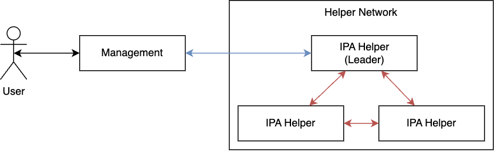

# DEVELOPMENT

This document explains this project from a developer lens and wont cover cryptography, business or goals of the project. Protocols explanation is focused on implementation and not on their justifications or reasons to exist. This guide aims to be a guide in how code is organized. Many of the submodules contain more specific details which we don’t cover here.
Links to different parts of the code will be provided in this document, hence it's key to first understand the [Cargo Project Layout](https://doc.rust-lang.org/cargo/guide/project-layout.html).

## High Level

The code in this repository implements a server that follows the IPA protocol for MPC. There’s a lot to be said about how these servers could be arranged to process IPA queries but for the sake of simplicity, we will focus on a simplified version. In this, users submit queries to the system, which are processed by 3 parties as part of a [secure multi-party computation](https://en.wikipedia.org/wiki/Secure_multi-party_computation). The following diagram illustrates this interaction:

 
*Fig 1: High level diagram*

In the non-sharded scenario, each of the IPA Helpers is one instance of the server running the code in this package.

The main use case is to enable submission and getting the results of queries. This is initiated by the user through a Query Management tool, which is currently incarnated as a binary called Reports Collector (the executable is [report_collector.rs](https://github.com/cberkhoff/ipa/blob/c0d3b61efd710f114d436656d944a4d91aecfda2/ipa-core/src/bin/report_collector.rs)). This tool takes both Impressions and Conversions datasets and submits them to the helper network. In this model, this tool can be seen as the "client" to interact with the Helper Network.

Helpers operate independently going through different states as requests arrive in the network. Each Helper can be abstracted as a State Machine with the following 3 states; Waiting, Query Preparation and Computing. Helpers wait until a query comes, at which point they will coordinate with other helpers in the network. The server that receives the query becomes the query leader. If all helper nodes are ready, they accept the request, parse the inputs and carry out the computation. Once done they go back to waiting. The Query Management tool keeps polling for the state of each helper. The main executable for Helpers is [helper.rs](https://github.com/cberkhoff/ipa/blob/c0d3b61efd710f114d436656d944a4d91aecfda2/ipa-core/src/bin/helper.rs).

As mentioned before, there are two modes of operation for the helper outside of waiting. The Inner struct in [app.rs](https://github.com/cberkhoff/ipa/blob/c0d3b61efd710f114d436656d944a4d91aecfda2/ipa-core/src/app.rs) contains two members to help with each of these states, the query_processor and mpc_transport used to prepare the helper for the incoming query and the actual computation of the query respectively. Both QueryProcessor and MPCTransports use HTTP for connections but they have different patterns and configurations. In spite of the previous, and due to lack of development time, we use the same HTTP server both for connections from other Helpers and Query Management (report collectors). Connections from other Helpers require TLS client certificate authentication (in red in Fig 1); whereas connections from report collectors should not. Connections from report collectors should, but currently don't, have some other kind of authentication.

We'll use Diagram 2 to describe the internals of the helper. On it, the boxes at the top rely on the boxes under them. Some of the boxes map to certain modules, but not all of them do. We refer to boxes in the diagram using the number next to them in parenthesis (e.g. ② refers to Transport). The left side of this diagram describes the Query Management action flow, which is initiated by the user. The right side describes the MPC Computation flow which is governed by the IPA ④ protocol at the top. After a query is submited MPC computation takes control. Query Management will keep polling for the status of the query, until all helpers are done.

 
*Fig 2: Helper internals*

## Query Management

The [helper module](https://github.com/cberkhoff/ipa/tree/c0d3b61efd710f114d436656d944a4d91aecfda2/ipa-core/src/helpers) can be seen as the infrastructure and utilities that enable the higher level protocols and query management.

The query processor ① is defined in [processor.rs](https://github.com/cberkhoff/ipa/blob/c0d3b61efd710f114d436656d944a4d91aecfda2/ipa-core/src/query/processor.rs) in the [query module](https://github.com/cberkhoff/ipa/blob/c0d3b61efd710f114d436656d944a4d91aecfda2/ipa-core/src/query/mod.rs). It makes sure Helpers are coordinated and each party has all the input required. Note that once the computation starts, the Processor is out of the picture and each Helper operates independently. The Processor's Rustdoc explains the steps when a query is received in more detail.

Query processor utilizes the [Transport layer](https://github.com/cberkhoff/ipa/tree/c0d3b61efd710f114d436656d944a4d91aecfda2/ipa-core/src/helpers/transport) ② to send and receive information from other helpers. Transport exposes generic send and receive methods. Transport is backend agnostic, and it currently supports in-memory and HTTP. 

The net module ③ contains the HTTP implementation of the Transport interface. Key struct are [MPCClient](https://github.com/cberkhoff/ipa/blob/c0d3b61efd710f114d436656d944a4d91aecfda2/ipa-core/src/net/client/mod.rs) and [MPCServer](https://github.com/cberkhoff/ipa/blob/c0d3b61efd710f114d436656d944a4d91aecfda2/ipa-core/src/net/server/mod.rs). Each helper has 3 MPCClients, one for each other related server. In the non-sharded scenario, a Helper is simply a single server. In the sharded scenario there are N servers for each helper. MPCClient uses [Hyper](https://hyper.rs/) and has methods for each of the communication methods. E.g. prepare_query, step, status, etc. MPCServer uses a higher level library built on top of hyper called [Axum](https://github.com/tokio-rs/axum). The server has [handlers](https://github.com/cberkhoff/ipa/tree/c0d3b61efd710f114d436656d944a4d91aecfda2/ipa-core/src/net/server/handlers) for each of the client methods.

With the aforementioned details we have enough technical details to describe the left side of Diagram 2. Users invoke report collector (Management) with the desired CLI parameters. For IPA, there is a [runbook](https://github.com/cberkhoff/ipa/blob/c0d3b61efd710f114d436656d944a4d91aecfda2/ipa-core/src/cli/playbook/ipa.rs) that will know what steps the client needs to take to prepare the Helpers. As part of that, first, the create_query API of a Helper is called with configuration parameters. The Helper that received the create_query call becomes the leader of the query and calls the other helpers prepare_query API. If everything went fine (all helpers were in waiting state, etc) the leader replies to Management with a query_id signaling that the Helpers are waiting for input. The Report Collector  parses the input files with secret shared events (impressions and conversions) and calls the input_query API (this can change in the future if we follow a pull aproach, where each Helper pulls the data from some coordinated location). After this, the Helpers have the information they need to not just start, but to complete the MPC Computation, which is discussed in the next section. 

While the computation is happening, Management will call the query_status API until all the Helpers are done, and will use the query_results API to gather all 3 results. Finally, the reports collector is able to combine all secret shared responses and present a report to the user.

## MPC Computation

MPC requires thousands of steps to be executed and coordinated across helpers. Each of these calls is represented as a single HTTP call (this becomes more relevant during MPC computation). The service uses HTTP2 multiplexing capabilities, where multiple requests are being sent and received during the same connection. 

**Work in progress**